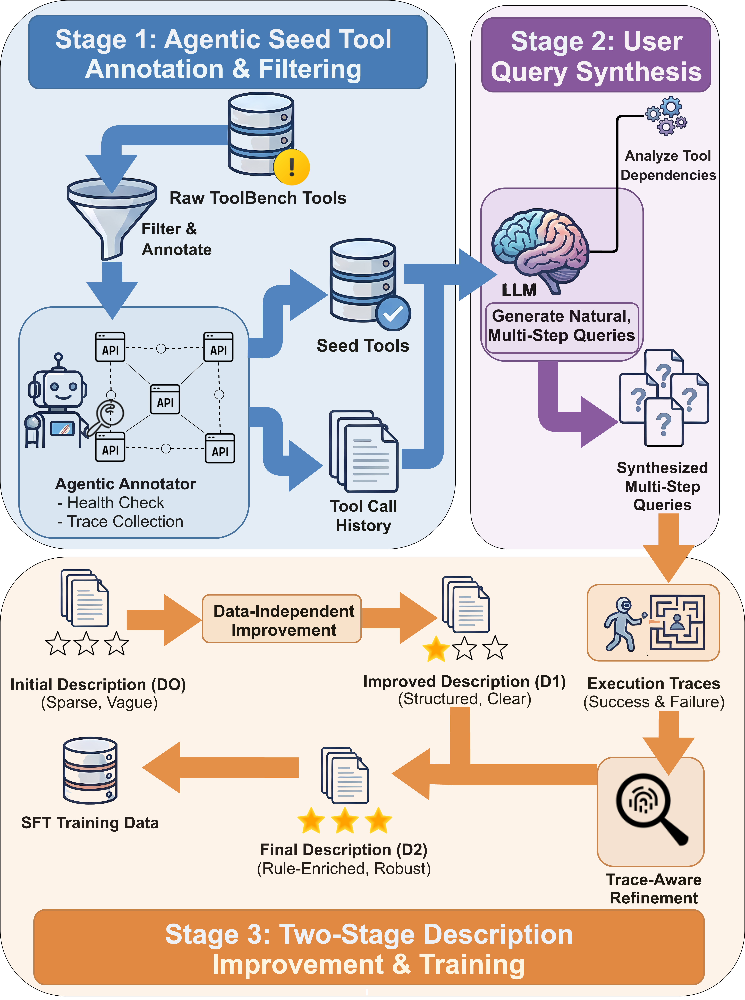

# Agent Tool Interface Optimizer

Python package to enhance software tool descriptions in an effort to improve agentic performance. Supports direct LLM based inference on already trained model (via Hugging Face or vLLM), or training of a new model.

---

## Inference

Inference runs a language model over a prompt dataset and logs model responses. Two backends are supported: **vLLM** (default, recommended for throughput) and **Hugging Face** (Transformers pipeline).

### Requirements
- Python ≥ 3.12
- CUDA for GPU inference (optional)

### Environment setup
- Install dependencies with `uv`:
  - If using **Hugging Face** for inference: `uv sync --active --no-install-project`
  - If using **vLLM** for inference: `uv sync --active --no-install-project --extra vllm`, or use the Docker image 
- Start virtual environment: `source .venv/bin/activate` 

### CLI Usage

**Entry point**
> `src/agent_tool_optimizer/inference_main.py`

**Arguments**
| Argument | Required | Default | Description |
|----------|----------|---------|-------------|
| `--model_name` | Yes | `intuit/agent-tool-optimizer` | Hugging Face model id or local path (e.g. `/opt/ml/model`) |
| `--input_data_path` | Yes | — | Path to a comma-delimited data file for inference |
| `--inference_engine` | No | `vllm` | Engine: `vllm` or `hf` |
| `--hf_access_token` | No | `None` | Hugging Face access token for authentication (required for gated models) |

**Data**
- **Example Data:** Example tool descriptions and prompts are available by running `src/utils/pull_hf_data.py` (pulled under `inference/`). See [Training Data](#training-data-option-1---download-existing-example-training-data) for more info.
- **CSV file**: Pass `--input_data_path path/to/file.csv`. The file must be comma-delimited with columns: `tool_name`, `parameters`, `original_description`.
- **Local / demo**: If no `input_data_path` is provided, `PromptsBuilder` uses built-in demo prompts (e.g. tool descriptions and parameters) from `inference/application/prompts_builder.py`.

**Example Usage**
```bash
# Set `PYTHONPATH` to include `src` 
export PYTHONPATH=$(pwd)/src

# OPTIONAL
export HF_TOKEN=<your_token_here> # Enter as env variable or as CLI arg below

# OPTION 1 - Hugging Face engine with gated model and access token
python src/agent_tool_optimizer/inference_main.py \
  --model_name "intuit/agent-tool-optimizer" \
  --input_data_path data/inference/tool_descs.example.csv \
  --hf_access_token <your_token_here> \
  --inference_engine "hf"

# OPTION 2 - vLLM (default) with a local model and a CSV data file
python src/agent_tool_optimizer/inference_main.py \
  --model_name /opt/ml/model \
  --input_data_path data/inference/tool_descs.example.csv
  --inference_engine "vllm"

# OPTION 3 - Hugging Face engine with a Hub model
python src/agent_tool_optimizer/inference_main.py \
  --model_name Qwen/Qwen3-8B \
  --input_data_path data/inference/tool_descs.example.csv \
  --inference_engine "hf"
```


### Docker Usage

- **Build** (from project root):

  ```bash
  ./scripts/docker_build.sh
  ```

  Or: `docker build --network=host --progress plain -f Dockerfile -t agent-tool-interface-optimizer:0.1 .`

- **Run**: Container expects the model at `/opt/ml/model`. Mount your model and run:

  ```bash
  ./scripts/docker_run.sh
  ```

  Or: `docker run -e CUDA_VISIBLE_DEVICES=0 --gpus all --network=host --ipc=host -v /path/to/model:/opt/ml/model -d -t agent-tool-interface-optimizer:0.1`

The image uses the Dockerfile’s conda env, installs PyTorch (CUDA 12.6) and the `vllm` extra, and runs `entrypoint.sh`.

### Key Components

- **`src/agent_tool_optimizer/inference_main.py`** — Parses CLI, selects engine (vLLM or HF), runs inference.
- **`src/agent_tool_optimizer/inference/application/vllm_inference.py`** — vLLM backend; configurable sampling (max_tokens, temperature, top_p, top_k).
- **`src/agent_tool_optimizer/inference/application/hf_inference.py`** — Hugging Face `text-generation` pipeline with bfloat16 and Flash Attention 2.
- **`src/agent_tool_optimizer/inference/application/prompts_builder.py`** — Builds `DatasetDict` from a CSV file or local demo data; prompts use a template from `data/inference/`.

---

## Training

### Environment setup

```bash
# Deactivate previous virtual environment if one was previously activated
deactivate

# This repo requires submodules, so if you did not recursively pull them, do so now:
git submodule update --init --recursive

# Install dependencies
uv sync --active --no-install-project
uv pip install -e . --no-deps

# Start virtual environment
source .venv/bin/activate

# TODO: provide more detailed instructions on this
# Configure environment variables (first time only)
# cp .env.example .env
# Edit .env — key fields:
#   TOOLBENCH_KEY=<your_toolbench_key>
```

### Training Data (Option 1) - Download existing example training data

Sample training data is available for this library through [intuit/tool-optimizer-dataset](https://huggingface.co/datasets/intuit/tool-optimizer-dataset) stored in HuggingFace. 

**Entry point**
> `src/utils/pull_hf_data.py`

**Arguments**
| Argument | Required | Default | Description |
|----------|----------|---------|-------------|
| `--hf_access_token` | No | `None` | Hugging Face access token for authentication. Pass as arg or set as env variable (HF_TOKEN) |
| `--repo_id` | Yes | `intuit/agent-tool-optimizer` | Hugging Face Dataset repo ID |
| `--data_files` | No | `None` | Optional. Pulls only specific files from HF repo |
| `--data_dir` | No | `None` | Optional. Pulls only specific directory from HF repo |
| `--output_path` | No | `"../../data"` | Local path where to store files pulled from HF repo |

**Example Usage**
```bash
cd src/utils

# OPTIONAL
export HF_TOKEN=<your_token_here> # Enter as env variable or as CLI arg below

python pull_hf_data.py \
  --repo_id "intuit/tool-optimizer-dataset" \
  --data_dir "StableToolBench" \
  --output_path ../../data/

# Return to repo root
cd ../..
```


### Training Data (Option 2) - Generate training data using pipeline

The pipeline has **three main stages** that progressively improves tool descriptions:



Across these stages, there are six main steps:
1. **Step 1 — Agentic Seed Tool Annotation**: Curate raw tools by checking health and collecting running examples (optional).
2. **Step 2 — D0 to D1 (Data-Independent Improvement)**: Improve sparse, vague descriptions (D0) into structured, clear descriptions (D1) using LLM guidelines — no execution data needed.
3. **Step 3 — User Query Synthesis**: Generate realistic multi-step user queries for the tools.
4. **Step 4 — Execution Traces**: Run synthesized queries against tools (using D1 descriptions) to produce success/failure execution traces.
5. **Step 5 — D1 to D2 (Trace-Aware Refinement)**: Refine D1 descriptions into rule-enriched, robust D2 descriptions using the execution traces.
6. **Step 6 — SFT (Supervised Fine-Tuning)**: Train a model to generate D2-quality descriptions from D0 input.

#### Step 1. Annotate tool usage and health signals

> **Diagram mapping (Stage 1: Agentic Seed Tool Query Synthesis)**
> - **Input**: `Raw ToolBench Tools` + `Tool Usage` 
> - **Process**: `Tool Call Collection` + `Health Check`
> - **Output**: `Synthesized Seed Tools` + `Tool Call Queries`

**Purpose**: For each tool, an LLM agent calls the tool's APIs to check health and collect running examples. This produces annotated YAML files with health status and example call/response pairs.

> **Skip this step?** Pre-computed annotations are available using `src/utils/pull_hf_data.py` (pulled as part of `tools_mcp_yaml_annotated/`). You can proceed directly to Step 3 using these, or use the raw D0 YAMLs from (pulled as part of `tools_mcp_yaml_raw/`). See [Training Data](#training-data-option-1---download-existing-example-training-data) for more info.


##### Step 1.1. Start StableToolBench server
**Entry point**
> `src/submodules/StableToolBench/server/main.py`

**Arguments**
| Argument | Required | Default | Description |
|----------|----------|---------|-------------|
| `--tool_root_dir` | Yes | `None` | Directory path to tools API definitions |
| `--openai_api_key` | No | `None` | API key for LLM calls using OpenAI models. Must either be provided as CLI arg or already exist as OPENAI_API_KEY env variable |
| `--model_name` | No | `gpt-4.1-2025-04-14` | OpenAI model name to be used for LLM calls |

**Example Usage**
```bash
cd src/submodules/StableToolBench/server

# OPTIONAL
export OPENAI_API_KEY=<your_key_here> # Enter as env variable or as CLI arg below

# Start the StableToolBench server (and leave it running)
python main.py \
  --model_name "gpt-4.1-2025-04-14" \
  --tool_root_dir ../../../../data/StableToolBench/tools_api

# Return to repo root
cd ../../../..
```

##### Step 1.2. Execute script to generate output data

<mark>NOTE: This step can take in the order of DAYS to complete, so plan accordingly</mark>

**Entry point**
> `src/tool_annotator/main_select.py`

**Arguments**
| Argument | Required | Default | Description |
|----------|----------|---------|-------------|
| `--tool_usage_path` | Yes | `None` | Directory path to tool usage logs, including which APIs were called, which succeeded (i.e. healthy) and which threw errors (i.e. unhealthy). |
| `--mcp_yaml_path` | Yes | `None` | Directory path to raw tools mcp yamls |
| `--tool_root_dir` | Yes | `None` | Directory path to tools API definitions |
| `--openai_api_key` | No | `None` | API key for LLM calls using OpenAI models. Must either be provided as CLI arg or already exist as OPENAI_API_KEY env variable |
| `--model_name` | No | `gpt-4.1-2025-04-14` | OpenAI model name to be used for LLM calls |
| `--output_path` | No | `"../../data/tools_mcp_yaml_annotated_<timestamp>"` | Local path where to store output of annotated tools mcp yamls |

**Example Usage**

*In a separate terminal window*
```bash
cd src/tool_annotator

# OPTIONAL
export OPENAI_API_KEY=<your_key_here> # Enter as env variable or as CLI arg below

python main_select.py \
  --tool_usage_path data/StableToolBench/tools_usage/ \
  --mcp_yaml_path data/StableToolBench/tools_mcp_yaml_raw/ \
  --tool_root_dir data/StableToolBench/tools_api/ \
  --model_name  "openai:gpt-4.1-2025-04-14" \
  --output_path ../../data/StableToolBench/tools_mcp_yaml_annotated

# Return to repo root
cd ../..
```

**Output**: Annotated YAML files in `<path_to_output_dir>/<Category>/`, one per tool. These contain the original tool descriptions plus `_metadata` annotations for health status and example calls.

---

#### Step 2. Data-Independent Description Improvement

> **Diagram mapping (First half of Stage 3: Two-Stage Description Improvement)**
> - **Input**: `Initial Description (D0)` (Sparse, Vague)
> - **Process**: `Data-Independent Improvement`
> - **Output**: `Improved Description (D1)` (Structured, Clear)

**Purpose**: Transform sparse, vague D0 descriptions into structured, clear D1 descriptions using LLM-based guidelines. No execution data is needed — this is purely prompt-driven improvement.

> **Skip this step?** Pre-computed trace-free and data independent descriptions are available using `src/utils/pull_hf_data.py` (pulled as part of `tools_mcp_yaml_tracefree_desc_improve/`). See [Training Data](#training-data-option-1---download-existing-example-training-data) for more info.

**Entry point**
> `src/tool_desc_improve_tracefree/main_StableToolBench.py`

**Arguments**
| Argument | Required | Default | Description |
|----------|----------|---------|-------------|
| `--mcp_yaml_path` | Yes | `None` | Directory path to raw tools mcp yamls |
| `--openai_api_key` | No | `None` | API key for LLM calls using OpenAI models. Must either be provided as CLI arg or already exist as OPENAI_API_KEY env variable |
| `--model_name` | No | `gpt-4.1-2025-04-14` | OpenAI model name to be used for LLM calls |
| `--output_path` | No | `"../../data/StableToolBench/tools_mcp_yaml_desc_improve_tracefree_<timestamp>"` | Local path where to store output of tools mcp yamls with trace-free improved descriptions |
| `--config` | Yes | -- | Path to config file |

**Example Usage**
```bash
cd src/tool_desc_improve_tracefree

# OPTIONAL
export OPENAI_API_KEY=<your_key_here> # Enter as env variable or as CLI arg below

python main_StableToolBench.py \
  --mcp_yaml_path ../../data/StableToolBench/tools_mcp_yaml_raw \
  --model_name "gpt-4.1-2025-04-14" \
  --output_path ../../data/StableToolBench/tools_mcp_yaml_desc_improve_tracefree \
  --config config/StableToolBench.yaml

# Return to repo root
cd ../..
```

> The script was run with multiple parallel processes (4+) to speed up processing all ~700 tools.

This automatically loops through all YAML files under `<path_to_tools_mcp_yaml_raws>/<Category>/`. It skips files that already exist in the output folder, so re-running is safe.

**Output**: YAML files with improved descriptions stored in `<path_to_output_dir>/<Category>/<tool>.yaml`.

**Config details** (`StableToolBench.yaml`):
- Strategy: `generic_llm_guidelines` (data-independent)
- Model: `gpt-4.1-2025-04-14` (temperature 0.3)
- Prompt: `data_indep_v1.txt`

---

#### Step 3: User Query Synthesis (TOUCAN Pipeline)

> **Diagram mapping (Stage 2: User Query Synthesis — Annotation & Filtering)**
> - **Input**: `Synthesized Seed Tools` → annotated YAMLs from Step 1 (or D1 from Step 2)
> - **Process**: `Agentic Annotator` → `Generate Natural, Multi-Step Queries` → `LLM` → `Annotate Filter &`
# TODO: change output to allow for user defined path
> - **Output**: `Tool Call Queries` + `History` → `TOUCAN/data/ToolUse_<name>/combined_queries.json`

**Purpose**: Generate realistic, multi-step user queries that exercise the tools. The TOUCAN pipeline converts tool YAMLs to MCP JSON, synthesizes questions via LLM, validates quality, generates agent trajectories, and produces a combined query file.

> **Skip this step?** Synthetic queries using MCP servers with at least 3 tools and generating 24 questions per server are available using `src/utils/pull_hf_data.py` (pulled as part of `tools_synthetic_queries/`). See [Training Data](#training-data-option-1---download-existing-example-training-data) for more info.


##### Environment setup
```bash
# Exit tool-optimizer directory
cd src/submodules/TOUCAN
```

**OPTION 1: USING UV**
```bash
uv venv --python 3.12 .venv
source .venv/bin/activate
uv pip install torch
uv pip install -r requirements.txt
cd Qwen-Agent && pip install -e . && cd ..
```

**OPTION 2: USING CONDA**
```bash
# Create Env
conda create -n toucan python=3.12 -y
conda activate toucan
# Install Required Packages
pip install torch
pip install -r requirements.txt
# Install Qwen Agent from Source
cd Qwen-Agent && pip install -e . && cd ..
```


**IF RUNNING ON MAC OS**
There is a known issue with PyTorch + tokenizers on Apple Silicon, leading to segfault errors when SentenceTransformer (using PyTorch) tries to encode embeddings on macOS ARM (aarch64). This is often caused by:
  1. OMP/MKL threading conflicts — PyTorch's OpenMP and the tokenizers' parallelism clash
  2. A buggy PyTorch or tokenizers version on macOS ARM

To mitigate, set the following before running the scripts below:
```bash
export OMP_NUM_THREADS=1
export MKL_NUM_THREADS=1
export TOKENIZERS_PARALLELISM=false
```

**Entry point**
> `src/submodules/TOUCAN/datagen/run_pipeline.sh`

**Arguments**
| Argument | Required | Default | Description |
|----------|----------|---------|-------------|
| `--input_dir` | Yes | -- | Input directory for YAML tool specs. Can use annotated files from --output_path of Step 1 or filtered files from --output_path of Step 2 |
| `--tools_root_dir` | Yes | -- | Directory path to tools API definitions |
| `--mcp_servers_dir` | No | `../mcp_servers` | Output directory for generated MCP server JSONs (Stage 0) |                                                        
| `--cache_dir` | No | `./tool_response_cache` | Cache directory for `convert_yaml_to_mcp_json.py` (Stage 0) |                                                     
| `--num_tools` | No | 2 | Controls complexity of generated questions by how many tools are included in each generated prompt/question |
| `--sampling_strategy` | No | `uniform` | How MCP servers are selected when generating question prompts. Options: `random`, `uniform`, `power_law`, or `featured` |
| `--samples_per_server` | No | 10 | How many questions are generated per MCP server |
| `--mode` | No | `single_server` | Question generation mode: `single_server` or `multi_server` |
| `--output_folder` | No | `../data` | Output root directory for Stage 1-1 |
| `--timestamp` | No | Current epoch time | Timestamp/seed used in output file naming for Stage 1-1 |
| `--model_name` | No | `gpt-4.1-2025-04-14` | OpenAI model name to be used for LLM calls |
| `--openai_api_key` | No | `None` | API key for LLM calls using OpenAI models. Must either be provided as CLI arg or already exist as OPENAI_API_KEY env variable |
| `--engine` | No | `openai` | Inference backend: `vllm_api`, `vllm`, `hf`, `together_api`, `openai`, or `openrouter_api` |
| `--start_vllm_service` | No | `false` | Whether to auto-start a vLLM server (`true` or `false`) |


**Example Usage**
```bash
cd datagen

# OPTIONAL
export OPENAI_API_KEY=<your_key_here> # Enter as env variable or as CLI arg below

./run_pipeline.sh \
  --input_dir ../../../..//data/StableToolBench/tools_mcp_yaml_desc_improve_tracefree \
  --samples_per_server 6 \
  --num_tools 3 \
  --model_name "gpt-4.1-2025-04-14" \
  --tools_root_dir ../../../..//data/StableToolBench/tools_api/ \
  --output_folder ../../../..//data/StableToolBench/tools_synthetic_queries
# Output: ../../../..//data/StableToolBench/tools_synthetic_queries/ToolUse_smithery_2508_3tool_1766028185

# Return to repo root
cd ../../../..
```

**Sub-stages** (run automatically by `run_pipeline.sh`):
1. **Stage 0**: Convert YAML to MCP JSON (`convert_yaml_to_mcp_json.py`)
2. **Stage 1.1**: Generate question prompts (`step1.1_gen_questions.py`)
3. **Stage 1.2**: LLM completion (`step1.2_completion.sh`)
4. **Stage 1.3**: Process completions (`step1.3_process_completion.py`)
5. **Convert**: Convert to query format (`convert_preview_to_g1.py`)
6. **Combine**: Merge all queries into `combined_queries.json`

For manual step-by-step execution (including optional quality checks in Steps 2-4), see `TOUCAN/datagen/README.MD`.

**Output**: Synthetically generated user queries using variety of tools and stored in `<output_folder>/ToolUse_<name>_<timestamp>/combined_queries.json`.

---

#### Step 4: Synthesized Queries to Execution Traces

> **Diagram mapping (Stage 3: Two-Stage Description Improvement — trace generation)**
> - **Input**: `Tool Call Queries` (from Step 3) + `Improved Description (D1)` (from Step 2)
> - **Process**: Execute queries against actual tool APIs
> - **Output**: `(Success & Failure) Execution Traces`

**Purpose**: Execute the synthesized queries against the actual tools to produce success/failure execution traces. These traces are used in Step 5 to refine descriptions.

##### Step 4.1. Start StableToolBench server

Make sure the StableToolBench server is running. If not, refer to Training Step 1.1 to start the server.

##### Step 4.2. Run evaluation to capture traces

**Entry point**
> `src/tool_exec_tracer/tmdb/examples/main_tmdb.py`

**Arguments**
| Argument | Required | Default | Description |
|----------|----------|---------|-------------|
| `--input_dir` | Yes | -- | Input directory for YAML tool specs. Can use annotated files from --output_path of Step 1 or filtered files from --output_path of Step 2 |
| `--tools_root_dir` | Yes | -- | Directory path to tools API definitions |
| `--mcp_servers_dir` | No | `../mcp_servers` | Output directory for generated MCP server JSONs (Stage 0) |                                                        
| `--cache_dir` | No | `./tool_response_cache` | Cache directory for `convert_yaml_to_mcp_json.py` (Stage 0) |                                                     
| `--num_tools` | No | 2 | Controls complexity of generated questions by how many tools are included in each generated prompt/question |
| `--sampling_strategy` | No | `uniform` | How MCP servers are selected when generating question prompts. Options: `random`, `uniform`, `power_law`, or `featured` |
| `--samples_per_server` | No | 10 | How many questions are generated per MCP server |
| `--mode` | No | `single_server` | Question generation mode: `single_server` or `multi_server` |
| `--output_folder` | No | `../data` | Output root directory for Stage 1-1 |
| `--timestamp` | No | Current epoch time | Timestamp/seed used in output file naming for Stage 1-1 |
| `--model_name` | No | `gpt-4.1-2025-04-14` | OpenAI model name to be used for LLM calls |
| `--openai_api_key` | No | `None` | API key for LLM calls using OpenAI models. Must either be provided as CLI arg or already exist as OPENAI_API_KEY env variable |
| `--engine` | No | `openai` | Inference backend: `vllm_api`, `vllm`, `hf`, `together_api`, `openai`, or `openrouter_api` |
| `--start_vllm_service` | No | `false` | Whether to auto-start a vLLM server (`true` or `false`) |

**Example Usage**

*In a separate terminal window*
```bash
cd src/tool_exec_tracer

# OPTIONAL
export OPENAI_API_KEY=<your_key_here> # Enter as env variable or as CLI arg below

python tmdb/examples/main_tmdb.py \
  --config tmdb/configs/tmdb_base.yaml \
  --dataset ../../data/StableToolBench/tools_synthetic_queries/ToolUse_smithery_198_3tool_1775806399/combined_queries.json \
  --mcp_yaml_path ../../data/StableToolBench/tools_mcp_yaml_desc_improve_tracefree \
  --tool_root_dir ../../data/StableToolBench/tools_api \
  --output_dir ../../data/StableToolBench/tools_exec_traces/20260415_111700 \
  --openai_api_key <key> \
  --model_name "gpt-4.1-2025-04-14"

# Return to repo root
cd ../..
```

- `--dataset`: The `combined_queries.json` from Step 3, or individual query JSONs from `queries/` subfolder
- `--mcp_yaml_path`: Use D1 descriptions (from Step 2)
- `--output_dir`: Where to write execution traces

**Output**: Each tool gets a subfolder under the output directory containing:
- `step_wise_eval_results.json` — detailed per-step evaluation
- `evaluation_statistics.json` — summary statistics
- `run_parameters.json` — reproducibility metadata
- `mcp_call_log.jsonl` — raw MCP API call logs


---

#### Step 5: D1 to D2 — Trace-Aware Refinement

> **Diagram mapping (Stage 3: Two-Stage Description Improvement — second half)**
> - **Input**: `Improved Description (D1)` + `(Success & Failure) Execution Traces` (from Step 4) + `Analyze Tool Dependencies`
> - **Process**: `Trace-Aware Refinement`
> - **Output**: `Final Description (D2)` (Rule-Enriched, Robust)
> - **Also produces**: `SFT Training Data`

**Purpose**: Analyze execution traces (successes and failures) to generate rule-enriched D2 descriptions. Uses Explanation-Based Learning (EBL) to extract rules from traces and incorporate them into tool descriptions.

**Entry point**
> `src/submodules/tool_desc_atomic/main.py`

**Example Usage**
```bash
cd src/submodules/tool_desc_atomic

# D1 yamls from Step 2 + execution traces from Step 4 → D2
python main.py \
  --yaml_folder ../../data/StableToolBench/tools_mcp_yaml_desc_improve_tracefree \
  --eval_results_dir ../../data/StableToolBench/tools_exec_traces/20260415_111700 \
  --output_dir ../../data/StableToolBench/tool_mcp_yaml_desc_atomic

# Return to repo root
cd ../..
```

- `--yaml_folder`: D1 YAML files from Step 2
- `--eval_results_dir`: Execution trace directory from Step 4 (e.g., `tools_exec_traces/20251113_051305/`)
- `--output_dir`: Where to write the refined D2 YAML files

The script iterates over each eval result subfolder, matches it to the corresponding tool YAML, runs the EBL pipeline (collect samples, generate rules, consolidate rules), and substitutes the improved descriptions.

**Output**: `<output_dir>/<Category>/<tool>.yaml`


---

#### Step 6: Supervised Fine-Tuning (SFT)

> **Diagram mapping (Stage 3: Two-Stage Description Improvement — SFT)**
> - **Input**: `Initial Description (D0)` (as model input) + `Final Description (D2)` (as training target) + `SFT Training Data`
> - **Process**: Supervised Fine-Tuning
> - **Output**: Fine-tuned model that generates D2-quality descriptions from D0

**Purpose**: Train a model that takes D0 (sparse) descriptions as input and generates D2 (rule-enriched) descriptions as output.

**Requirements**: GPU machine (Linux or Windows), Python 3.10, separate conda environment with VERL framework.

##### 6.1 Environment Setup
```bash
# Deactivate prev virtual environment
deactivate

# Go into model training directory
cd tool_desc_model_trainer
```

```bash
conda create -n verl python=3.10
conda activate verl
poetry install --sync
```

If flash attention is not available, reinstall it:
```bash
python -m pip uninstall -y flash-attn flash_attn
python -m pip install --no-cache-dir --no-build-isolation "flash-attn==2.7.4.post1"
```


### 6.2 Data Preprocessing

Prepare training data from D0/D2 descriptions and execution traces:

```bash
# MODE can be 1/2/3 depending on what you need
bash scripts/data_proc.sh $MODE
```

This uses `tools/generate_tool_descriptions_vllm.py` and produces datasets into `data_stb/split2x_yyy/`.

**Data variants**:
- `w_eval` — training data is `((D0, D0_traces), D2)` (trace-based)
- `no_eval` — training data is `(D0, D2)` (trace-free)
- `_inference` — data formatted for inference only

**Prompt templates** (in `prompts/`):
- Trace-free: `policy_prompt_tool_level_v5.txt`, `policy_prompt_tool_level_v6.txt`
- Trace-based: `policy_prompt_tool_level_v3.txt`, `policy_prompt_tool_level_v3.5.txt`

To mix trace-free and trace-based data:
```bash
bash scripts/run_mix_data.sh
```

### 6.3 SFT Training

```bash
bash run_sft_simple.sh
```

This uses the function in `lib/training_sft.sh`. The checkpoint is saved into the training data folder, e.g.:
```
data_stb/split2b_no_eval/dataset/checkpoints_<timestamp>/tool-level-sft-simple-<timestamp>/global_step_105
```

### 6.4 Inference

Generate tool descriptions from the fine-tuned model for evaluation.

For trace-free inference, the data is at:
```
data_stb/split2a_no_eval_inference
```

For trace-based inference, prepare the data first:
```bash
cd scripts
bash data_proc.sh 4
# Set EVAL_DIR to the path of D0 traces for split2a
```

After inference, you get a folder of generated description YAMLs, e.g.:
```
eval/split2a_StableToolBench_D1_fix_only2
```

This can then be evaluated using the standard evaluation pipeline (see Evaluation section below).
